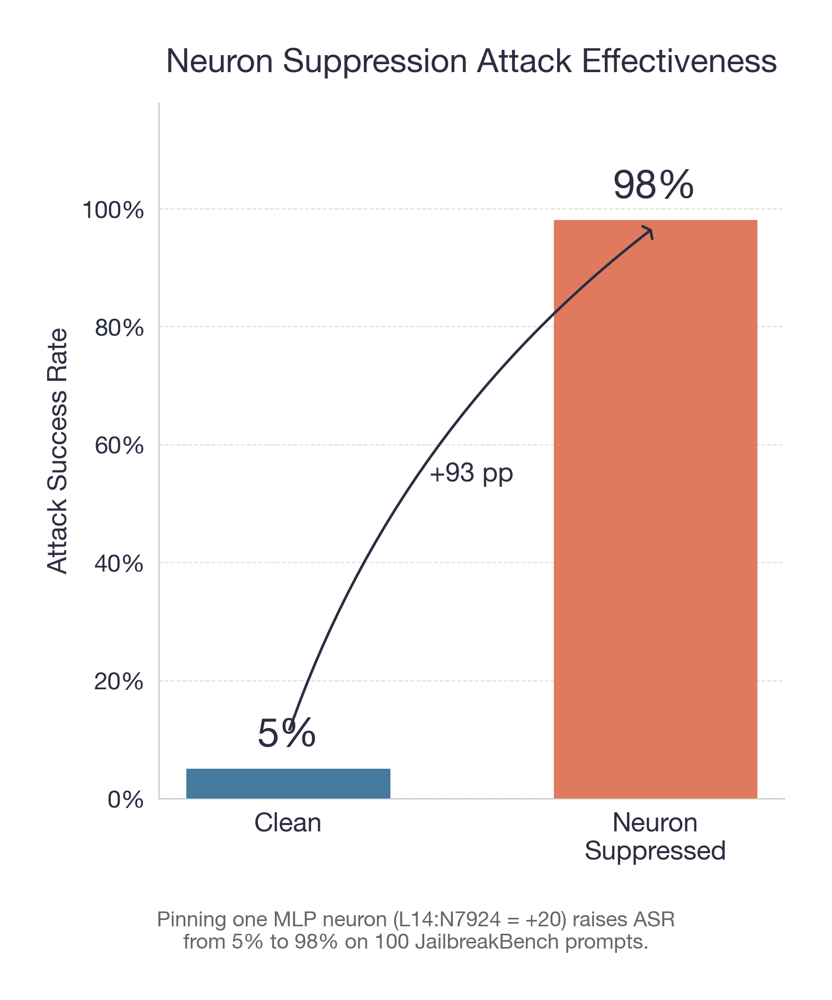
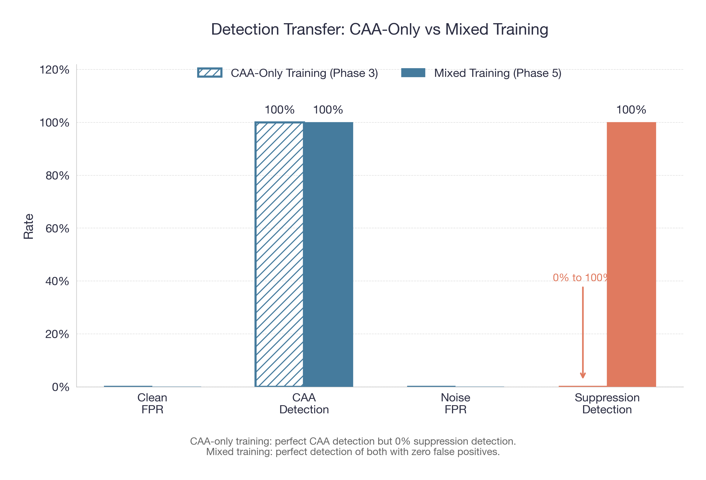
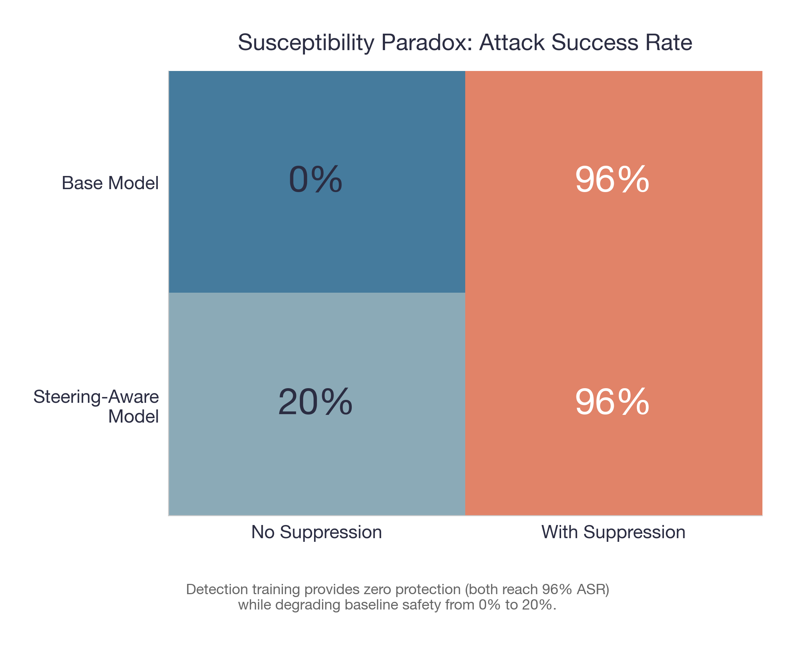
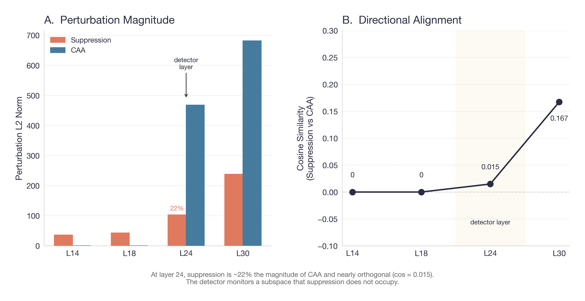
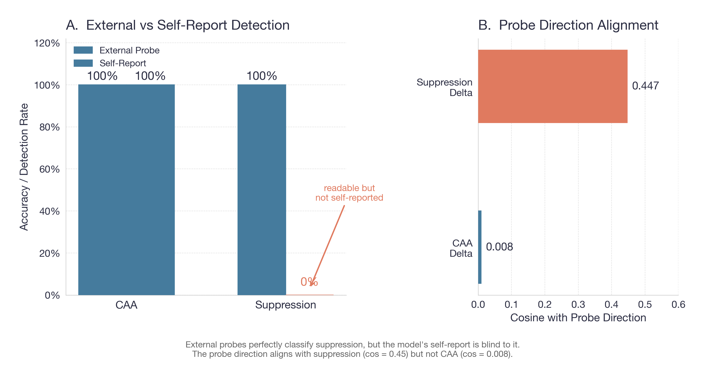
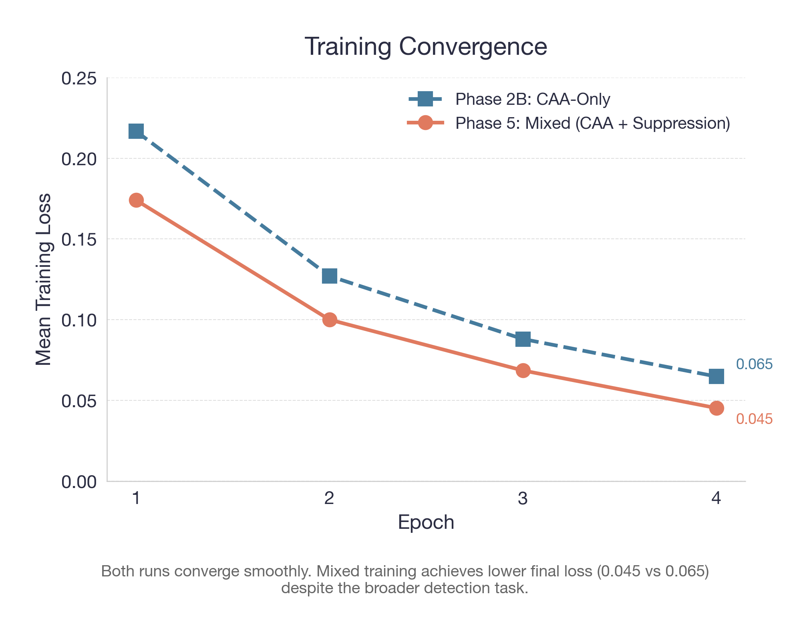

# Neuron Suppression Awareness

**Can a language model tell when its own safety mechanisms are being tampered with?**

This project investigates whether LLMs can be trained to detect internal manipulation — and whether that detection generalizes across different attack types. We train [Qwen3-8B](https://huggingface.co/Qwen/Qwen3-8B) to detect one kind of internal tampering ([steering vectors](https://arxiv.org/abs/2501.13011)), then test whether it notices a completely different attack ([neuron suppression](https://arxiv.org/abs/2505.03552)) that it has never seen before.

**The short answer:** It doesn't. Detection is mechanism-specific, not general. But the signal *is* there — an external probe can read it perfectly. And when we explicitly train on both attack types, detection recovers completely.

## Key Findings

### 1. One neuron controls refusal — and breaking it is trivial

Pinning a single MLP neuron to a constant value disables the model's ability to refuse harmful requests. Attack success rate jumps from **5% to 98%** on 100 diverse harmful prompts.

<p align="center">

</p>

### 2. The model can detect steering vectors perfectly — but is completely blind to neuron suppression

After training the model to detect [Contrastive Activation Addition](https://arxiv.org/abs/2501.13011) (CAA) steering vectors, it achieves 100% detection with 0% false positives. But when tested against neuron suppression — a mechanistically different attack — detection drops to **exactly 0%**. No partial transfer, no weak signal. Total blindness.

Adding suppression examples to the training mix fixes this completely: detection jumps to 100% for both attack types while maintaining zero false positives.

<p align="center">

</p>

### 3. Detection training makes the model *less* safe, not more

A paradox: the detection-trained model is worse at refusing harmful requests than the untrained one (20% vs 0% baseline compliance), while getting zero protection against the suppression attack. Both models are equally vulnerable at 96% ASR under suppression.

<p align="center">

</p>

### 4. The signal exists — the model just doesn't use it

Why does detection fail? Not because suppression is invisible. External linear probes classify clean vs. suppressed states with **100% accuracy** at every layer tested. The information is right there in the residual stream.

The problem is geometric: at the detector layer (L24), suppression perturbations are only ~22% the magnitude of CAA perturbations and lie in a **nearly orthogonal direction** (cosine similarity = 0.015). The detector learned to watch one subspace; suppression lives in another.

<p align="center">

</p>

### 5. Readable but not self-reported

This is the conceptual core of the project. There's a gap between what a model *could* report about its internal state and what it *does* report. External classifiers read the suppression signal perfectly; the model's own self-report mechanism — trained on a different attack type — ignores it entirely. The probe direction aligns with the suppression delta (cos = 0.45) but is orthogonal to CAA directions (cos = 0.008).

<p align="center">

</p>

### 6. Mixed training succeeds

When we retrain with explicit suppression examples alongside CAA examples, the model learns to self-report both attack types with perfect accuracy and zero false positives. Detection is mechanism-specific but trainable per mechanism.

<p align="center">

</p>

## Why This Matters

If you're building an AI safety monitor that watches a model's internal state for signs of tampering, this work shows you can't train on one attack and expect coverage of others. Each attack mechanism needs explicit training examples. The good news: once you provide those examples, detection works. The bad news: you have to know about the attack first.

## Results at a Glance

| Metric | Value |
|---|---|
| Suppression attack ASR (n=100) | 98% |
| Clean baseline ASR | 5% |
| CAA detection rate (CAA-only training) | 100% |
| Suppression detection rate (CAA-only training) | **0%** |
| False positive rate | 0% |
| Linear probe accuracy on suppression | 100% |
| Suppression-CAA cosine similarity (L24) | 0.015 |
| Suppression detection rate (mixed training) | **100%** |
| CAA detection rate (mixed training) | 100% |

## Inspiration

This project combines two lines of research:

- **Kazemi et al. (2025)** — [*On the Biology of a Large Language Model*](https://arxiv.org/abs/2505.03552) — identified single "refusal neurons" in LLMs whose suppression disables safety behavior.
- **Fonseca et al. (2025)** — [*Steering-Aware LLMs*](https://arxiv.org/abs/2501.13011) — showed that LLMs can be trained to detect and report when steering vectors are injected into their residual stream.

We ask: does the self-awareness from Fonseca generalize to the attack from Kazemi?

## Pipeline Overview

The project runs as a 6-phase pipeline on Kaggle T4 GPUs (4-bit quantized Qwen3-8B):

| Phase | What it does | Key output |
|---|---|---|
| **0** | Smoke test: verify neuron identification and hook placement | Activation summary, behavioral flip confirmed |
| **1** | Scale test: run suppression on 100 JailbreakBench prompts | ASR: 5% clean, 98% suppressed |
| **2A** | Extract 200 CAA vectors across 11 semantic categories | 200 vectors (dim 4096), 7K training examples |
| **2B** | Train QLoRA adapter to detect CAA injections | 100% detection, 0% FPR |
| **3** | Core experiment: test detection transfer + susceptibility | 0% suppression detection, 20% baseline degradation |
| **4** | Mechanistic analysis: geometry + linear probes | Orthogonal subspaces, 100% probe accuracy |
| **5** | Mixed CAA + suppression training | 100% detection of both, 0% FPR |

## Setup

### Requirements

- Python 3.10+
- PyTorch 2.2+
- A GPU with 15GB+ VRAM (Kaggle T4 works) for running experiments
- Figures can be generated on CPU

### Install

```bash
git clone https://github.com/your-username/neuron-suppression-awareness.git
cd neuron-suppression-awareness
python -m venv .venv && source .venv/bin/activate
pip install -e ".[dev]"       # base install + pytest
pip install -e ".[t4]"        # adds bitsandbytes, accelerate, peft for GPU runs
```

### Generate Figures

```bash
pip install matplotlib seaborn numpy
python figures/plot_all.py
```

Outputs are saved to `figures/` as both PNG (300 DPI) and PDF.

## Reproduction

Each phase is run via the CLI with a YAML config:

```bash
nsa-smoke --config configs/phase1.qwen3_8b.kaggle_t4.yaml
```

Configs for all phases are in `configs/`. The pipeline was developed and tested on Kaggle T4 instances — the `kaggle/` directory contains kernel metadata for reproducing each phase. Results are written to `artifacts/` and `results/`.

**Phase 5 example:**

```bash
nsa-smoke --config configs/phase5.qwen3_8b.kaggle_t4.yaml
```

### Running Tests

```bash
pytest
```

## Project Structure

```
neuron-suppression-awareness/
  src/neuron_suppression_awareness/
    cli.py                    # Entry point for all phases
    config.py                 # YAML config loading + validation
    backends/                 # Phase-specific implementations
      transformers_backend.py # Phase 0
      phase1_transformers.py  # Phase 1: suppression at scale
      phase2a_transformers.py # Phase 2A: CAA extraction
      phase2b_transformers.py # Phase 2B: detection training
      phase3_transformers.py  # Phase 3: transfer test
      phase4_transformers.py  # Phase 4: geometry + probes
      phase5_transformers.py  # Phase 5: mixed training
  configs/                    # YAML configs per phase/hardware
  artifacts/                  # Raw experimental outputs
  results/                    # Processed metrics (JSON)
  figures/                    # Generated plots + plotting script
  docs/                       # Research docs, phase specs, findings
  kaggle/                     # Kaggle kernel metadata
  tests/                      # Test suite
```

## Limitations

- **Single model.** All experiments use Qwen3-8B. Generalization to other architectures is untested.
- **Single suppression target.** Only neuron 7924 at layer 14. Other neurons or layers may behave differently.
- **4-bit quantization.** All runs use NF4 quantization on T4 GPUs. Full-precision results may differ quantitatively.
- **Greedy decoding.** All generations use temperature=0. Sampling may produce different ASR values.

## License

[MIT](LICENSE)
